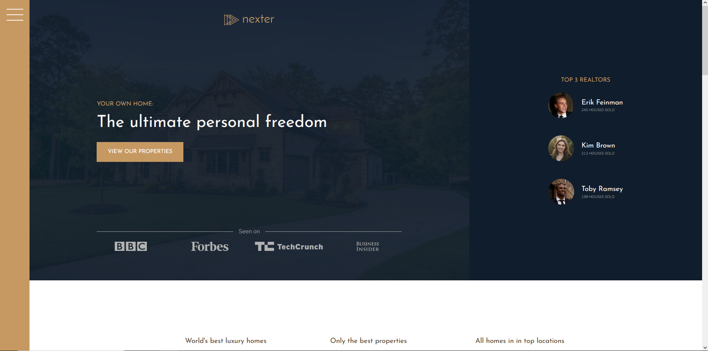
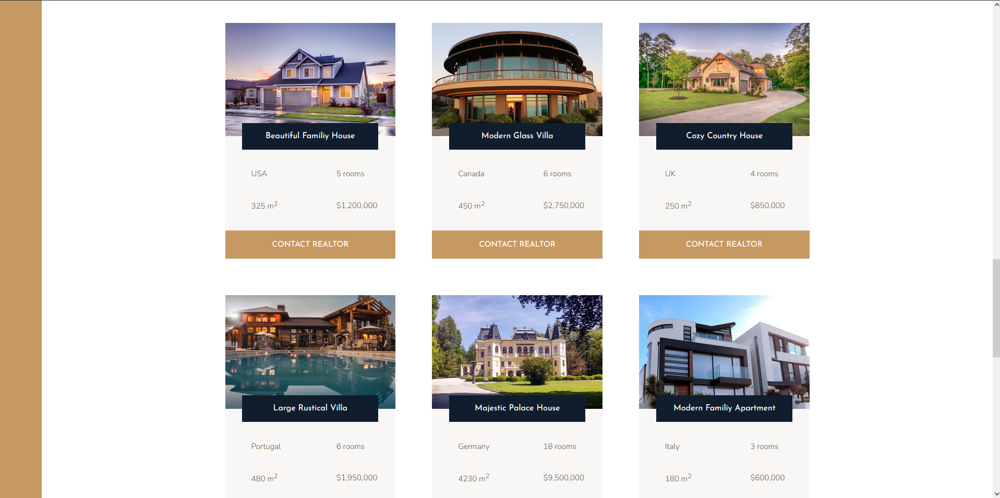

# Nexter - Luxury Homes

## Overview
Nexter is a website dedicated to showcasing luxurious houses available for sale. Designed with elegance and simplicity in mind, it uses advanced HTML and CSS techniques to present properties in the most appealing way. Nexter is the perfect platform for potential buyers looking for their dream home with high-end amenities.

## Screenshots
Below are some screenshots that display the functionality and design of the Nexter website:

### Home Page






## Technologies Used
- **HTML5**: For structuring the content.
- **CSS3/SCSS**: Utilizing advanced CSS techniques along with SCSS for efficient, maintainable styling. SCSS allows us to use variables, nested rules, mixins, functions, and more, which help in writing CSS in a more structured way.
- **Sass (SCSS)**: A preprocessor scripting language that is interpreted or compiled into Cascading Style Sheets (CSS). We use SCSS syntax for more advanced features like variables, mixins, and nested rules that make the CSS more maintainable.

## Getting Started

### Prerequisites
This project requires no special packages, just a modern web browser to run. Supported browsers include:
- Google Chrome
- Mozilla Firefox
- Safari
- Microsoft Edge

### Running the Project
1. **Clone the repository**
   ```bash
   git clone https://github.com/yourusername/nexter.git
   cd nexter
